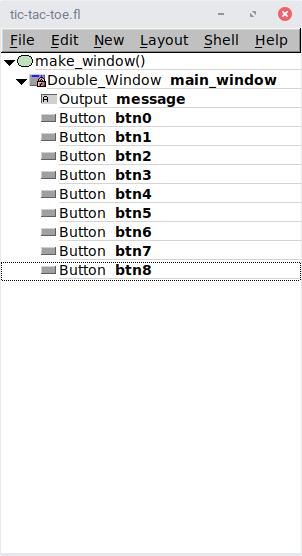
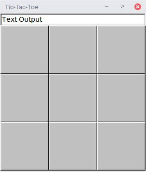
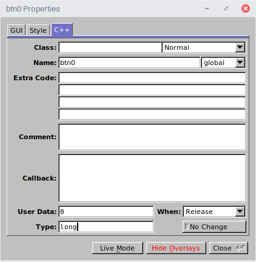

Phase 1 - GUI and Basic Control
===============================
In this phase, we construct the basic GUI and controller.  When we are
done, the application will run, but it will only register X moves.
(The player will always be X.)

To start off with, we create the GUI.  The layout consists of the
following widgets:



The preview of the window is shown below:



There are a few things to point out about this.  First of all, the
buttons are marked global, as is the text output widget.  This is so
we can assign callbacks and values as needed.

Another thing worth mentioning are the cells themselves.  These are
100x100 buttons.  Their font size is set to 82 with Helvetica Bold
font.  This makes a nice big letter that fills the button.  

Also, to help the moves link up to the callback later, they each have
a number assigned to their user data field as shown below:



This way, given a pointer to a button, we can pull up the
corresponding button index number:

```c++
(long) button->user_data();
```

The Controller
==============
We also start the controller in this phase.  Here, we construct
a method which registers the callbacks to each of the buttons.  This
file also has an array which it constructs from the button pointers to
make it easier to reference each button.  

The callback itself just puts an X in the box and then sets the
callback to the nullptr.  This prevents further action on the button
because the square will be occupied.


The Application and Build Scripts
=================================
Finally, we construct a main.cpp which puts all the pieces together.
The last thing in this phase is an updated makefile, which allows the
application to be built.

Go ahead and build and run the application. Get familiar with what it
does.
